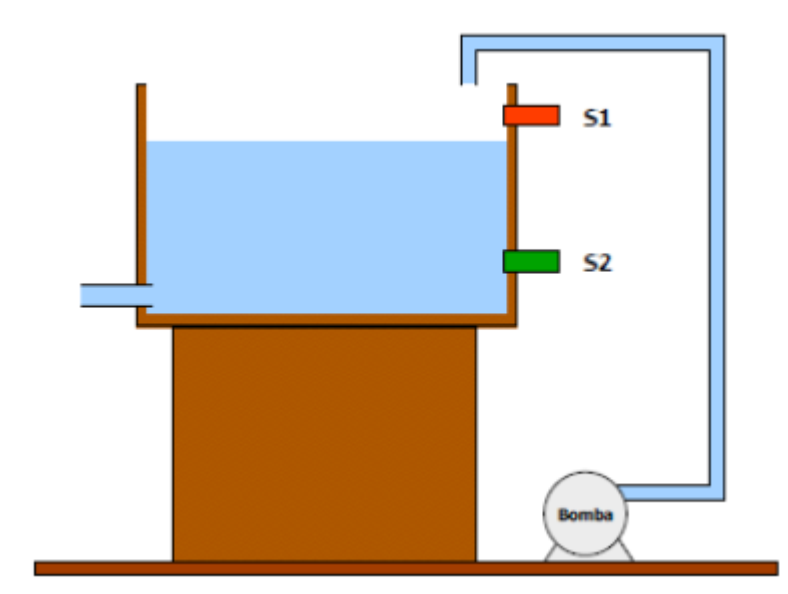
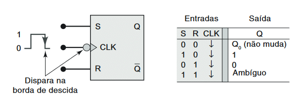
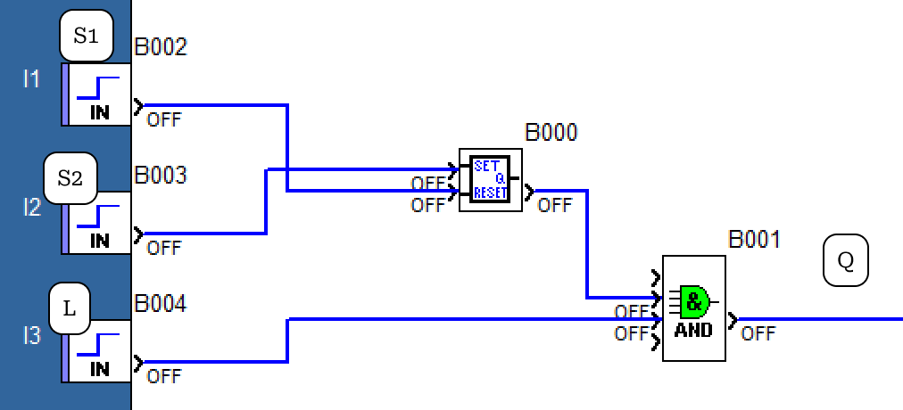
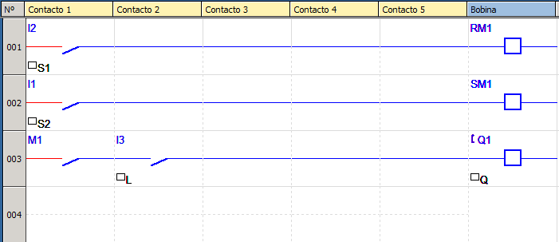

# Automação Industrial

## Enunciado do exercício

Deseja-se controlar o nível de uma caixa d'água entre um valor máximo e mínimo. Existem para isto dois sensores de nível, NA para nível máximo $(S_1)$ e NF, nível mínimo $(S_2)$. Para encher esta caixa, é utilizada uma bomba centrífuga que será ligada ou desligada em função do nível da caixa. Se o sensor $S_2$ estiver fechado, a bomba é ligada, permanecendo assim até que o sensor $S_1$ seja ativado. Quando $S_1$ é fechado, a bomba é desligada permanecendo assim até que o sensor $S_2$ feche novamente. Este controle automático pode ser desligado manualmente por um interruptor L.

## Resolução em FBD

### Condições

Analisando o enunciado e a imagem, podemos concluir algumas condições do sistema:

- se $S_2 = 0$ então $Q = 1$ até que $S_1 = 1$.
  - Se o reservatório estiver vazio, acionar a bomba até enchê-lo.
- se $S_1 = 1$ então $Q = 0$ até que $S_2 = 0$.
  - Se o reservatório estiver cheio, desligar a bomba até esvaziá-lo.
- se $L = 0$ então $Q = 0$.
  - Se o interruptor estiver desligado, então desligar o sistema.

### Componentes

Entrada: sensores $S_2$, $S_1$ e interruptor L.
Saída: Q.

### Tabela Verdade do Sistema

| L | S1 | S2 | Q | Descrição                      |
| - | -- | -- | - | ------------------------------ |
| 0 | x  | x  | 0 | Interruptor desligado          |
| 1 | 0  | 1  | 1 | Enchendo reservatório          |
| 1 | 1  | 1  | 0 | Reservatório cheio, esvaziando |
| 1 | 0  | 1  | 0 | Esvaziando                     |
| 1 | 0  | 0  | 1 | Reservatório vazio, encher     |

### Circuito Digital Auxiliar

O circuito foi construído com um Flip-Flop Set Reset (FF SR) por causa da sua propriedade de memória $Q_0$ e definir uma saída 1 ou 0 com o Set ou o Reset respectivamente.

### Equação booleana

A equação booleana do sistema com o FF SR ficará da seguinte forma:

$$Q = L * \overline{S_2} + L * S_1$$
$$Q = ?$$

### Implementação

## Resolução em Ladder

Observando o circuito construído em Ladder, é possível traduzir facilmente para a linguagem FDB.

Foram utilizadas as entradas $I_1$, $I_2$ e $I_3$, bobina auxiliar $M_1$, de set $SM_1$ e reset $RM_1$, e saída $Q_1$.