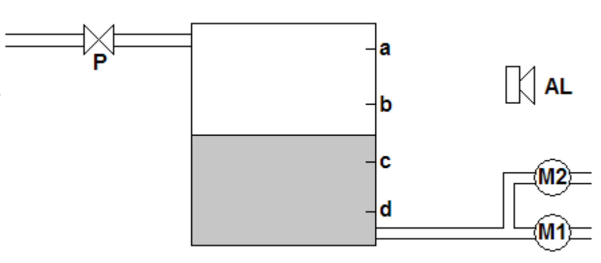
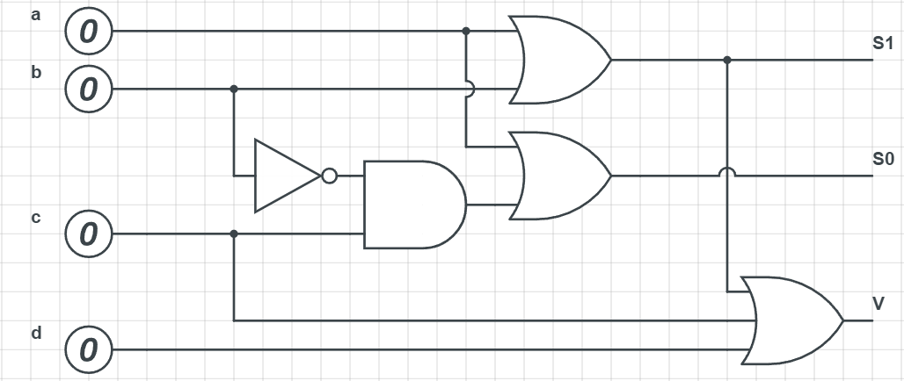
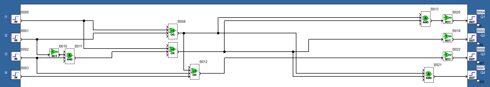
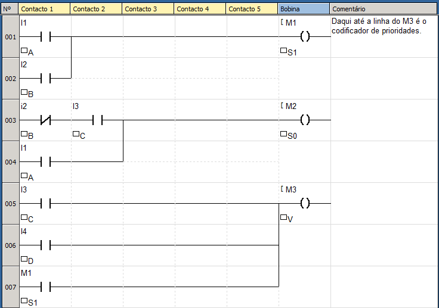

# Automação Industrial

## Enunciado do exercício 2

Elabore um programa para que um sistema de reservatório composto de uma válvula de entrada P, duas bombas (acionadas por M1 e M2), um alarme AL e quatro sensores de nível NA (a, b, c, d). As condições de funcionamento são as seguintes: se o nível estiver em “A”, então fecha-se a válvula P. Se o nível for inferior a “B”, então abre-se a válvula P. Acima de “B”, M1 e M2 bombeiam. Abaixo de “B”, somente M1 bombeia. Abaixo de “C”, soa o alarme AL. Abaixo de “D”, nenhuma das bombas deverá funcionar.

## Resolução em FBD

### Condições

Analisando o enunciado e a imagem, podemos obter as seguintes condições do sistema:

- $a = 1 \rightarrow P = 0$
    - Se nível estiver acima de a, então fechar válvula P.
- $b = 1 \rightarrow M1 = M2 = 1$
    - Se nível estiver acima de b, então ligar as duas bombas.
- $b = 0 \rightarrow P = 1, M1 = 1, M2 = 0$
    - Se nível estiver abaixo de b, abrir válvula, ligar bomba M1 e desligar M2.
- $c = 0 \rightarrow AL = 1$
    - Se nível estiver abaixo de c, então acionar alarme AL.
- $d = 0 \rightarrow M1 = M2 = 0$
    - Se reservatório estiver vazio, desligar as bombas.

### Componentes

- Entradas: a, b, c, d.
- Saídas: P, AL, M1, M2.

### Tabela Verdade do Sistema

A partir das condições propostas, foi construída a Tabela Verdade do sistema:

<!-- TODO: add descrição -->
| a | b | c | d | P | AL | M1 | M2 |
| - | - | - | - | - | -- | -- | -- |
| 1 | x | x | x | 0 | 0  | 1  | 1  |
| 0 | 1 | x | x | 1 | 0  | 1  | 0  |
| 0 | 0 | 1 | x | 1 | 0  | 1  | 0  |
| 0 | 0 | 0 | 1 | 1 | 1  | 1  | 0  |
| 0 | 0 | 0 | 0 | 1 | 1  | 0  | 0  |

### Circuito Digital Auxiliar

Um circuito digital útil para esta aplicação é o codificador de prioridades. Neste circuito, haverá uma saída diferente para cada entrada do sistema, tornando-se importante para mapear os sinais. 

A tabela verdade das entradas pode ser definida como um codificador de prioridades. A figura abaixo exibe como foi construído o circuito digital.

Tabela Verdade do codificador de prioridades:

<!-- TODO: add descrição -->
| a | b | c | d | S1 | S0 | V |
| - | - | - | - | -- | -- | - |
| 1 | x | x | x | 1  | 1  | x |
| 0 | 1 | x | x | 1  | 0  | x |
| 0 | 0 | 1 | x | 0  | 1  | x |
| 0 | 0 | 0 | 1 | 0  | 0  | 1 |
| 0 | 0 | 0 | 0 | 0  | 0  | 0 | 

### Equação booleana

Com as saídas padronizadas através do codificador, podemos definir a equação boolean para cada elemento do sistema.

$$P = \overline{a} = \overline{S1 * S2}$$
$$AL = \overline{c} = \overline{S0}$$
$$M1 = d = V$$
$$M2 = a = S1 * S2$$

### Implementação

Com todas as respostas em mão, podemos finalmente montar o circuito no simulador Zelios Software:

## Resolução em Ladder

<!-- TODO: add imagem -->

