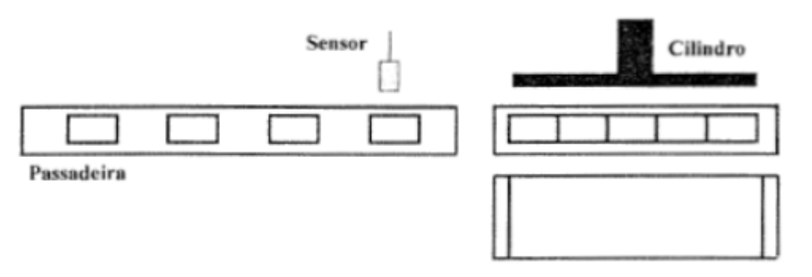
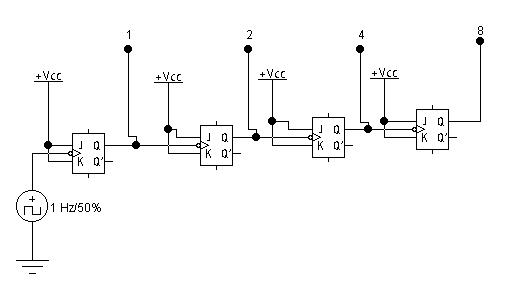
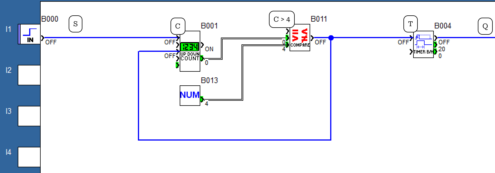
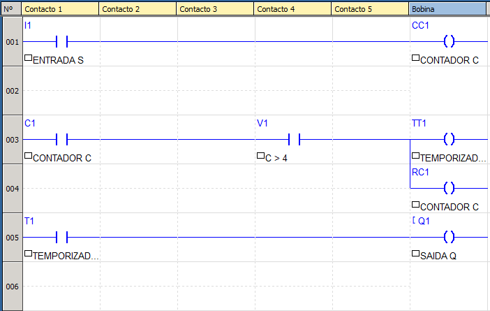

# Automação Industrial

## Enunciado do exercício

Este sistema é utilizado para detectar e contar o número de produtos que são transportados na linha de montagem. Quando são contados 5 produtos, o cilindro responsável por empacotar deverá ser ativado durante 2 segundos, e depois voltar à sua posição inicial.

## Resolução em FBD

### Condições

Analisando o enunciado e a imagem, podemos concluir algumas condições do sistema:

- se sensor = 1, então incrementar contador.
- se contador = 5, então empacotar e resetar contador.
- se empacotar, então ativar por 2 segundos e voltar para posição inicial.

### Componentes

- Entrada: Sensor S.
- Processamento: Contador C, Comparador (S > 4) e Temporizador T.
- Saída: Cilindro Q.

### Tabela Verdade do Sistema

| S | C | Q | Descrição                                 |
| - | - | - | ----------------------------------------- |
| 0 | 0 | 0 | Contador inicializa como 0                |
| 1 | 1 | 0 | Se passar um produto, contador incrementa |
| 0 | 1 | 0 |                                           |
| 1 | 2 | 0 | Contador incrementa                       |
| 0 | 2 | 0 |                                           |
| 1 | 3 | 0 | Contador incrementa                       |
| 0 | 3 | 0 |                                           |
| 1 | 4 | 0 | Contador incrementa                       |
| 0 | 4 | 0 |                                           |
| 1 | 5 | 1 | Se C > 4, então Empacotar                 |
| 0 | 0 | 0 | Zerar contador                            |

### Circuito Digital Auxiliar

O circuito foi construído com um contador, neste caso um contador *Up-Down* crescente e decrescente, o qual pode ser feito concatenando Flip-Flops JK mestre-escravo em série, como na imagem abaixo. 

Além do contador, também foi utilizado um comparador, o qual compara dois valores de entrada, neste caso a entrada S e o valor constante 4, e um temporizador, que envia um sinal high por 2 segundos a partir de um impulso de clock.

### Equação booleana

A equação booleana do sistema com o contador C, comparador C > 4 e temporizador T ficará da seguinte forma:

$$Q = 1, \text{por 2 segundos, se} \space C > 4$$

### Implementação

## Resolução em Ladder

