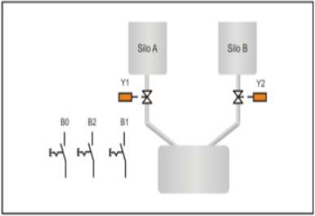
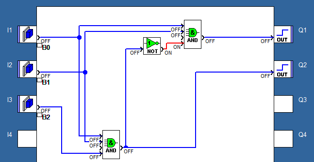
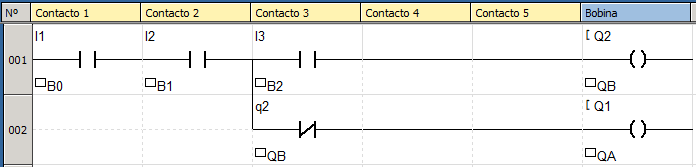

## Enunciado do exercício

**Aplicação com tanques de mistura**: Aplicação constituída por dois silos que contém diferentes receitas e um tanque maior para mistura dessas receitas. O sistema deve gerenciar a mistura das receitas de acordo com o desejado. O botão de seleção de misturas B2, seleciona qual das duas misturas será colocada no tanque principal. Com o botão B2 na posição 0, a mistura A é selecionada e adicionada ao tanque principal se o botão B1 for acionado simultaneamente. Do mesmo modo, com o botão B2 na posição 1, a mistura B é selecionada e adicionada ao tanque principal se o botão B1 for acionado simultaneamente. O botão B0 fecha as válvulas interrompendo a adição de receitas.

## Resolução em FBD

### Condições

Analisando o enunciado e a imagem, podemos concluir algumas condições do sistema:

- se $B_0 = 1$, então o sistema todo liga, senão desliga. O sistema tem que estar ligado para todas as condições abaixo funcionarem:
  - se $B_1 = B_2 = 0$, então nada acontecerá.
  - se $B_1 = 1$ e $B_2 = 0$, então $Q_A = 1$.
    - A mistura do silo A é adicionada ao tanque se o botão $B_1$ é acionado e $B_2$ não.
  - se $B_1 = 1$ e $B_2 = 1$, então $Q_B = 1$
    - A mistura do silo b é adicionada ao tanque se o botão $B_1$ e $B_2$ forem acionados.

### Componentes

- Entradas: botões $B_0$, $B_1$ e $B_2$.
- Saídas: $Q_A$, $Q_B$.

### Tabela Verdade do Sistema

| B0 | B1 | B2 | Qa | Qb | Descrição         |
| -- | -- | -- | -- | -- | ----------------- |
| 0  | x  | x  | 0  | 0  | Sistema desligado |
| 1  | 0  | 0  | 0  | 0  | Ligado            |
| 1  | 1  | 0  | 1  | 0  | Qa                |
| 1  | 1  | 1  | 0  | 1  | Qb                |

### Equação booleana

$$ Q_A = B_0 * B_1 * \overline{ Q_B } $$

$$ Q_B = B_0 * B_1 * B_2 $$

### Implementação

## Resolução em Ladder

