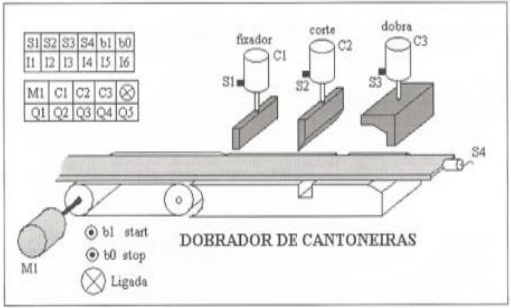
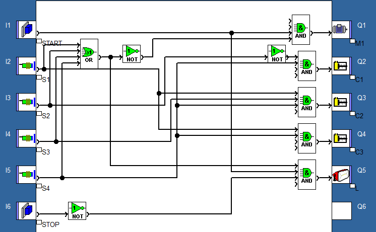

## Enunciado do exercício

**Dobradeira de peças**: Uma máquina dobradeira de peças necessita que seja feita sua programação da seguinte forma: Ao ligar a chave de start a esteira M1 liga até que o sensor S4 detecte material. Quando isso ocorrer a esteira para, o cilindro C1 avança até o seu sensor, em seguida o cilindro C3 avança também até o seu sensor (dobrando a peça). Em seguida, C3 recua e o cilindro C2 avança até seu respectivo sensor, cortando a peça. Feito isso os demais cilindros devem recuar Iberando a peça que cai em uma caixa finalizando o ciclo. A lâmpada deve ligar enquanto o ciclo estiver em funcionamento e o botão stop deve finalizar o ciclo.

## Resolução em FBD

### Condições

Analisando o enunciado e a imagem, podemos concluir algumas condições do sistema:

- se $\text{start} = 1$, então o sistema todo liga e $M_1 = 1$, senão desliga. O sistema tem que estar ligado para todas as condições abaixo funcionarem:
  - se $S_4 = 1$, então $M_1 = 0$, $L = 1$ e $C_1 = 1$
  - se $S_1 = 1$, então $C_3 = 1$
  - se $S_3 = 1$, então $C_3 = 0$ e $C_2 = 1$
  - se $S_2 = 1$, então $C_1 = 0$, $C_2 = 0$ e $M_1 = 1$
  - se $\text{stop} = 1$, então $L = 0$

### Componentes

- Entradas: botões start e stop, sensores $S_1$, $S_2$, $S_3$ e $S_4$.
- Saídas: Lâmpada $L$, esteira $M_1$, cilindros $C_1$, $C_2$, $C_3$.

### Tabela Verdade do Sistema

| stop | start | S1 | S2 | S3 | S4 | M1 | C1 | C2 | C3 | L | Descrição         |
| ---- | ----- | -- | -- | -- | -- | -- | -- | -- | -- | - | ----------------- |
| 1    | 0     | x  | x  | x  | x  | 0  | 0  | 0  | 0  | 0 | Sistema desligado |
| 0    | 1     | 0  | 0  | 0  | 0  | 1  | 0  | 0  | 0  | 0 | Liga esteira      |
| 0    | 1     | 0  | 0  | 0  | 1  | 0  | 1  | 0  | 0  | 1 | Fixador           |
| 0    | 1     | 1  | 0  | 0  | 1  | 0  | 1  | 1  | 0  | 1 | Dobrador          |
| 0    | 1     | 1  | 0  | 1  | 1  | 0  | 1  | 0  | 1  | 1 | Corte             |
| 0    | 1     | 0  | 1  | 0  | 1  | 0  | 0  | 0  | 0  | 1 | Retornar cilindos |
| 1    | 1     | 0  | 0  | 0  | 0  | 1  | 0  | 0  | 0  | 0 | Ciclo finalizado  |

### Equação booleana

$$ M_1 = start (\overline{S_1} + \overline{S_2} + \overline{S_3} + \overline{S_4}) $$

$$ L = start \cdot \overline{stop} (S_1 + S_2 + S_3 + S_4) $$

$$ C_1 = S_4 \overline{S_2} $$

$$ C_2 = S_4 S_3 S_1 $$

$$ C_3 = S_4 S_1 $$

### Implementação

## Resolução em Ladder

TODO:
