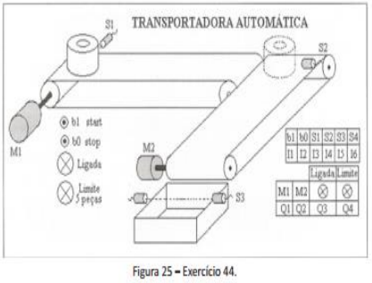
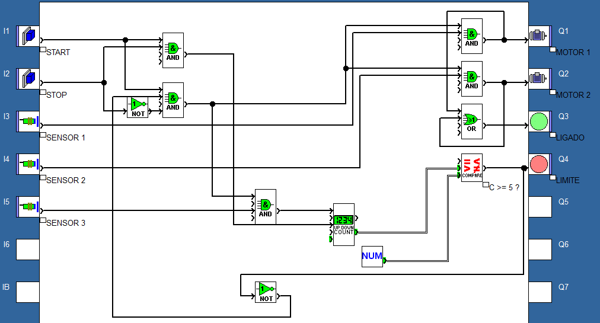
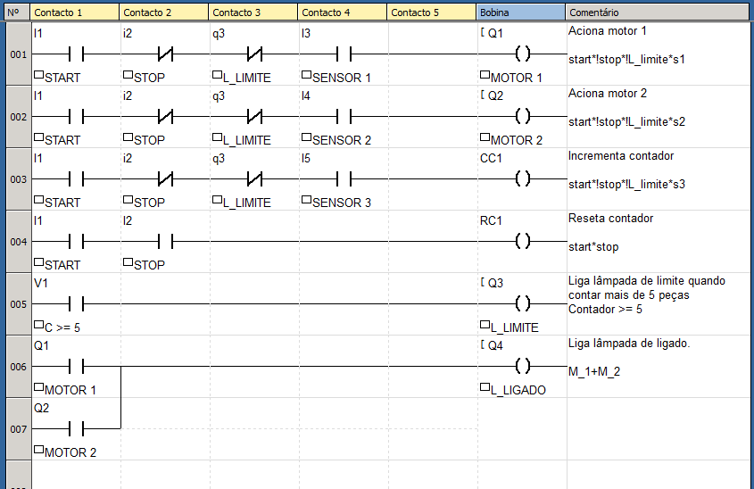

## Enunciado do exercício

**Máquina transportadora**: Ao pressionar o botão de start, a esteira M1 aciona somente quando existir peça no sensor S1. Quando a peça transportada chegar no sensor S2 a esteira M1 desliga e a esteira M2 liga até que a peça passe pelo sensor S3 desligando a esteira M2 e finalizando o ciclo. Quando completar o 5º ciclo a lâmpada de limite de 5 peças deve ligar e o usuário pressionar o botão de stop. Sempre que a esteira estiver em funcionamento, a lâmpada que indica que a máquina está ligada deverá permanecer acionada.

## Resolução em FBD

### Condições

Analisando o enunciado e a imagem, podemos concluir algumas condições do sistema:

- se $\text{start} = 1$, então o sistema todo liga (lâmpada acende) e é necessário que haja peça no sensor $S_1$ para acionar motor $M_1$. O sistema tem que estar ligado para todas as condições abaixo funcionarem:
  - se $S_2 = 1$, então $S_1 = 0$, $L_{ligado} = 1$ e $M_2 = 1$.
  - se $S_3 = 1$, então $S_2 = 0$ e $C++$
  - se $C = 5$, interrompe o processo.
    - se $stop = 1$, então volta o processo.

### Componentes

- Entradas: botões start e stop, sensores $S_1$, $S_2$ e $S_3$.
- Processamento: contador $C$.
- Saídas: Lâmpadas $L_{ligado}$ e $L_{limite}$, esteira $M_1$, motores $M_1$ e $M_2$.

### Tabela Verdade do Sistema

| stop | start | S_1 | S_2 | S_3 | Contador | M_1 | M_2 | L_limite | L_ligado | Descrição                                                     |
| ---- | ----- | --- | --- | --- | -------- | --- | --- | -------- | -------- | ------------------------------------------------------------- |
| 0    | 0     | x   | x   | x   | 0        | 0   | 0   | 0        | 0        | Máquina desligada                                             |
| 0    | 1     | 0   | 0   | 0   | 0        | 0   | 0   | 0        | 0        | Máquina ligada                                                |
| 0    | 1     | 1   | 0   | 0   | 0        | 1   | 0   | 0        | 1        | Sensor 1 detecta peça, aciona M1 e acende L_ligado            |
| 0    | 1     | 0   | 1   | 0   | 0        | 0   | 1   | 0        | 1        | Sensor 2 detecta peça, aciona M2 e continua L_ligado          |
| 0    | 1     | 0   | 0   | 1   | 1        | 0   | 0   | 0        | 0        | Sensor 3 detecta peça, incrementa contador e desliga L_ligado |
| 0    | 1     | 0   | 0   | 0   | 5        | 0   | 0   | 1        | 0        | Se contador >= 5, interromper sistema                         |
| 1    | 1     | 0   | 0   | 0   | 0        | 0   | 0   | 0        | 0        | Sistema retoma ao pressionar botão de stop, contador reseta   |
| 0    | 1     | 0   | 0   | 0   | 0        | 0   | 0   | 0        | 0        | Senão continua do jeito que tava                              |

### Equação booleana

$$ M_1 = start \cdot \overline{stop} \cdot \overline{L_{limite}} \cdot S_1 $$

$$ M_2 = start \cdot \overline{stop} \cdot \overline{L_{limite}} \cdot S_2 $$

$$ Contador_{contar} = start \cdot \overline{stop} \cdot \overline{L_{limite}} \cdot S_3 $$

$$ Contador_{reset} = start \cdot stop $$

$$ L_{ligado} = M_1 + M_2 $$

$$ L_{limite} = Contador \ge 5 $$

### Implementação

## Resolução em Ladder

