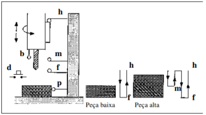
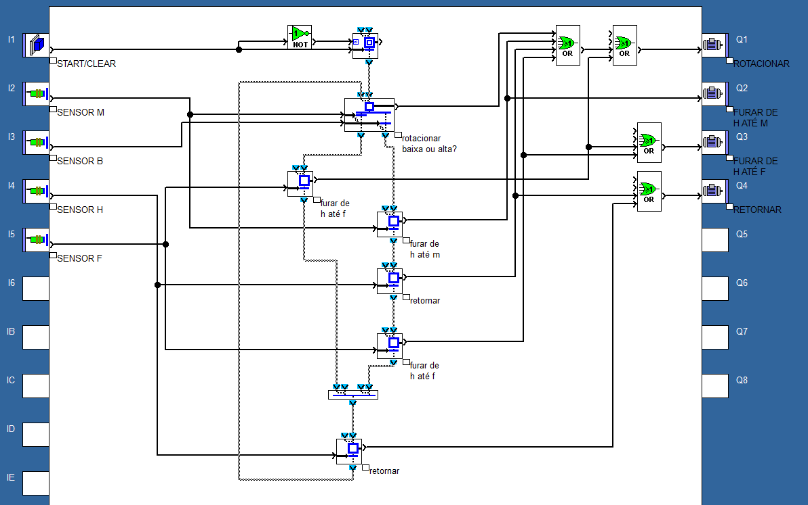

# Sistema de Furagem

Um sistema de furagem (ver Figura) permite o processamento de peças de duas alturas diferentes. Para o efeito utiliza o sensor b e o sensor m. Se uma peça é alta o sensor b é actuado primeiro que o m e se é baixa acontece o contrário. Também o processamento é diferente nos dois casos e está representado na figura. A furadora tem como posição inicial a mais alta. Durante todo o movimento descendente e ascendente a broca deve estar em funcionamento (rotação). O sistema pode funcionar de um modo ininterrupto desde que haja substituição (de uma forma automática ou não) das peças no fim de cada processamento.

## Resolução em Grafcet (FSC)

### Componentes

- Entradas: Sensores b, m h e f.
- Saídas: Motor de rotação, furar de h até m ou h até f, retornar.

### Implementação

