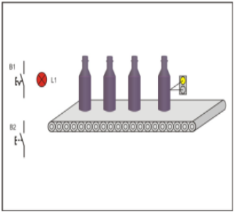
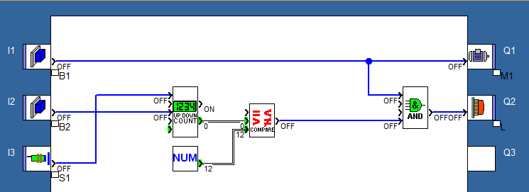
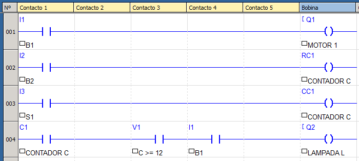

## Enunciado do exercício

**Fábrica de refrigerantes**: Em uma empresa de produção de refrigerantes, uma das etapas do processo deve contar as garrafas que passam em uma esteira. O processo é iniciado quando o botão B1 é pressionado, assim o motor da esteira (M1) entra em funcionamento. Assim que a quantidade de 12 garrafas passarem pelo feixe do sensor S1, a esteira deve parar e acender a lâmpada que indica quantidade desejada atingida. Se o botão de reset B2 for pressionado, o processo inicia novamente.

## Resolução em FBD

### Condições

Analisando o enunciado e a imagem, podemos concluir algumas condições do sistema:

- se $B_1 = 1$, então $M_1 = 1$
  - A esteira é acionada ao apertar o botão.
- se $S_1 = 1$, então $C += 1$
  - O contador incrementa ao passar uma garrafa pelo sensor.
- se $C \ge 12$, então $L = 1$
  - A lâmpada acende se passarem 12 ou mais garrafas.
- se $B_2 = 1$, então reset(C).
  - O contador será redefinido para 0 ao apertar o botão $B_2$.

### Componentes

- Entradas: botões $B_1$, $B_2$ e sensor $S_1$.
- Processamento: Contador $C$.
- Saídas: Lâmpada $L$ e esteira $M_1$.

### Tabela Verdade do Sistema

| B1 | B2 | S1 | C  | C >= 12 | L | M1 | Descrição                             |
| -- | -- | -- | -- | ------- | - | -- | ------------------------------------- |
| 0  | x  | x  | 0  | 0       | 0 | 0  | sistema desligado                     |
| 1  | 0  | 0  | 0  | 0       | 0 | 1  | ligar esteira                         |
| 1  | 0  | 1  | 1  | 0       | 0 | 1  | sensor detecta produto, contador++    |
| 1  | 0  | 1  | 12 | 1       | 1 | 1  | 12 produtos, ligar lâmpada            |
| 1  | 1  | x  | 0  | 0       | 0 | 1  | botão de reset acionado, contador = 0 |

### Equação booleana

$$ M_1 = B_1 $$

$$ L = (C \ge 12) B_1 $$

### Implementação

## Resolução em Ladder

