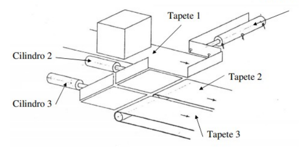
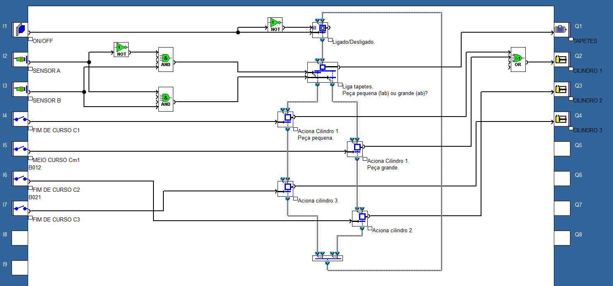

# Triagem de Caixas

Um dispositivo automático destinado à triagem de caixas de dois tamanhos diferentes, é composto por um tapete que transporta as caixas, três cilindros e dois tapetes de evacuação, conforme está ilustrado na figura. Se a caixa for grande deve ir para o tapete 3 e se for pequena para o 2.

Admita ainda:

Uma peça grande actua os sensores a e b e uma pequena só o b.

O cilindro 1 dispõe de um sensor de meio curso, sendo a peça a arrastar suficientemente pesada para que o cilindro pare imediatamente desde que lhe falta a alimentação.

a) Estabeleça o GRAFCET funcional para o sistema descrito apoiando-se na figura abaixo.

## Resolução em Grafcet (FSC)

### Componentes

- Entradas: Botão On/Off, sensores A e B, chaves de fim de curso C1, C2 e C3 e meio curso Cm1.
- Saídas: Motor dos tapetes, cilindros C1, C2 e C3.

### Implementação

