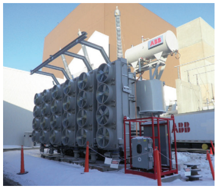
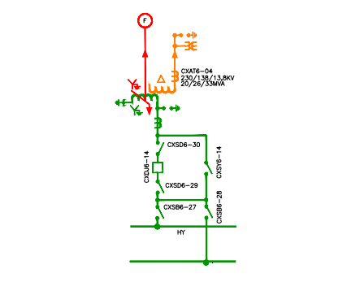
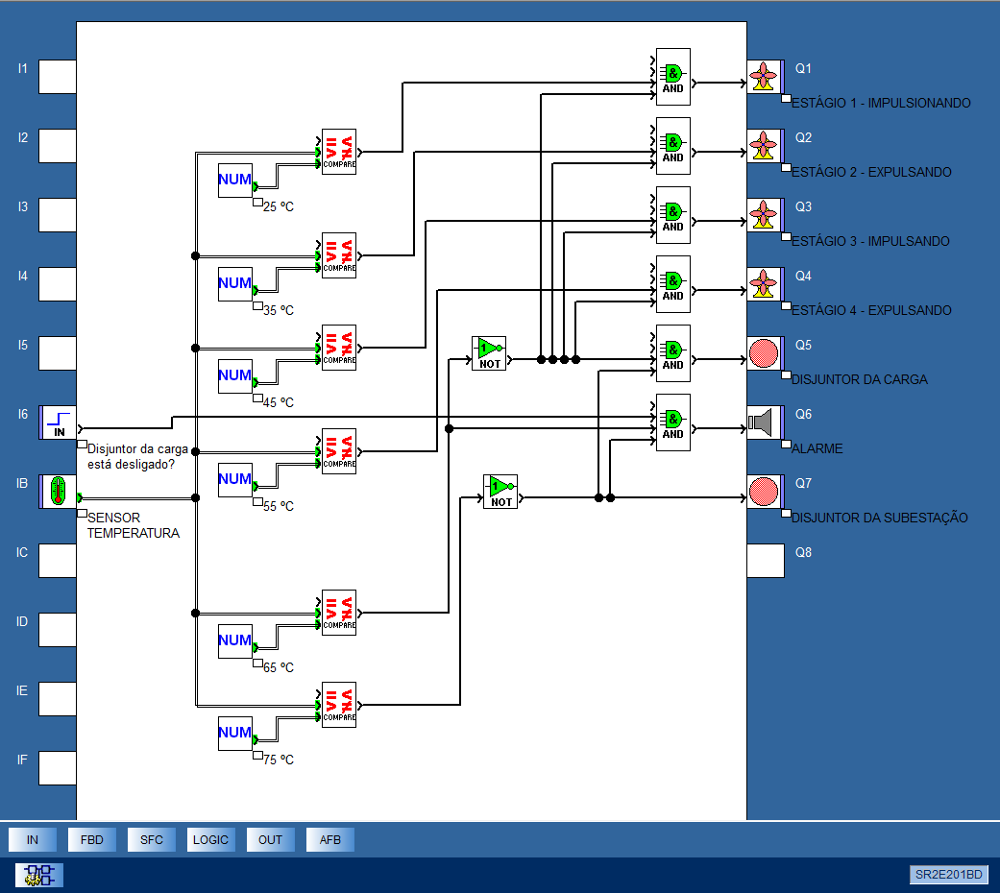

# Ventilação forçada em transformadores de potência

## Enunciado

Os transformadores de potência presentes nos sistemas de transmissão e distribuição usam óleo mineral ou vegetal como meio isolante. Sua refrigeração ocorre de forma natural, através da convecção do óleo e troca de calor com o meio ambiente por meio de dissipadores instalados na carcaça.

Entretanto, transformadores de médio/grande porte necessitam de atenção especial. Devido ao elevado custo e sua importância em sistemas elétricos de potência, esses transformadores possuem diversos sensores para monitorar temperatura do óleo, formação de gases, etc. Estes também contam com meios especiais para refrigeração do óleo isolante, para auxilar a refrigeração do óleo esses transformadores apresentam conjuntos de ventiladores usados para forçar a passagem do ar ambiente pelos dissipadores.

A Figura 1 ilustra um transformador de potência trifásico que conta com 24 ventiladores, acionados em quatro estágios.

Os estágios de ventilação são ligados de acordo com a necessidade, para temperaturas baixas todos os estágios estão desligados e, a medida que a temperatura eleva, liga-se um número definido para cada faixa de temperatura.

Caso a temperatura aumente muito, a ponto da ventilação forçada não proporcionar seu resfriamento, pode ser comandada a abertura dos disjuntores. O diagrama unifilar da Figura 2 ilustra a ligação de um transformador no barramento da subestação, o disjuntor "CXDJ6-14"conecta o transformador ao barramento. O disjuntor que conecta o transformador a carga encontra-se após o ponto "F".

1. Pesquise um sensor de temperatura para essa aplicação. Esse sensor deve ser capaz de medir temperaturas na faixa de 0-100 oC, e traduzir a temperatura medida em uma escala de tensão 0-10 V, a ser aplicada a uma entrada analógica de um Controlador Lógico Programável (CLP). O sinal de tensão fornecido pelo sensor será recebido por uma entrada analógica, a qual será usada para controlar quando cada ventilador é ligado.
2. Programar no CLP a operação dos ventiladores da seguinte forma:

- Para temperaturas menores ou iguais a 25 ºC nenhum ventilador será ligado.
- Para temperaturas entre 25 ºC e 35 ºC deve ser ligado um estágio.
- Para temperaturas entre 35 ºC e 45 ºC deve ser ligado dois estágios funcionando em sentido inverso (um impulsionando ar e outro expulsando)
- Para temperaturas entre 45 oC e 55 oC deve ser ligado três estágios funcionando em sentido inverso (dois impulsionando ar e um expulsando).
- Para temperaturas acima de 55 oC devem ser ligados os quatro estágios, dois impulsionando ar e dois expulsando.
- Para temperaturas acima de 65 oC deve-se desligar o disjuntor do lado da carga. Caso não abra o disjuntor deve-se soar um alarme.
- Se a temperatura ultrapassar 75 oC deve-se abrir o disjuntor do barramento da subestação.
- Sinalizar todas as fases de operação e o sentido de giro de cada estágio de
ventilação.

3.  Ilustrar as ligações das entradas e saídas do CLP.
4.  Ilustrar o diagrama de comando dos ventiladores (considerar que são motores de indução trifásicos).

## Resolução

### FDB

### Ladder

TODO