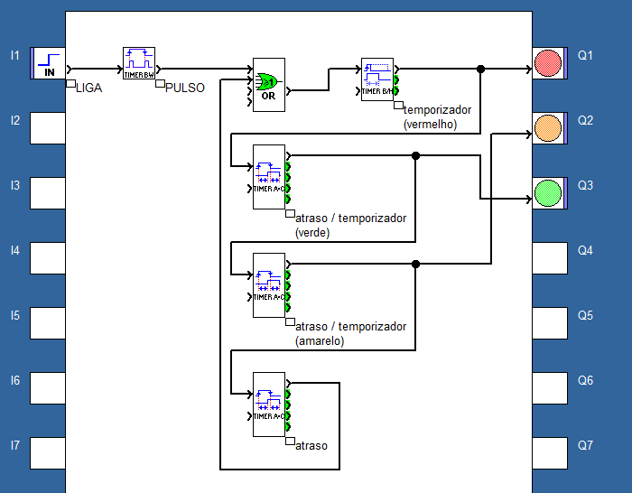
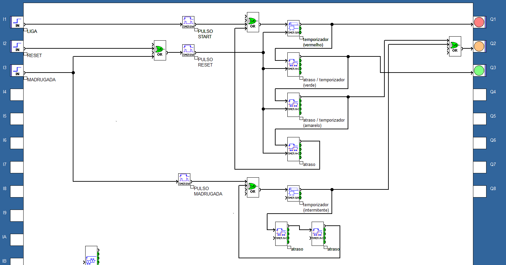
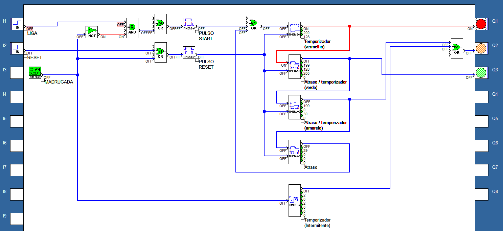
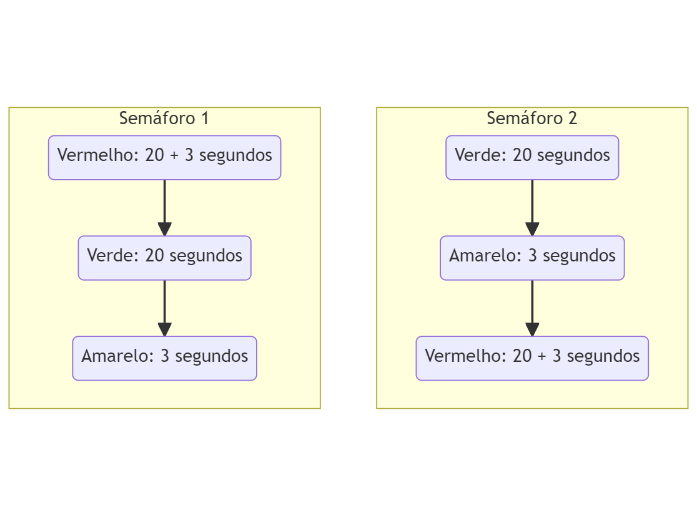
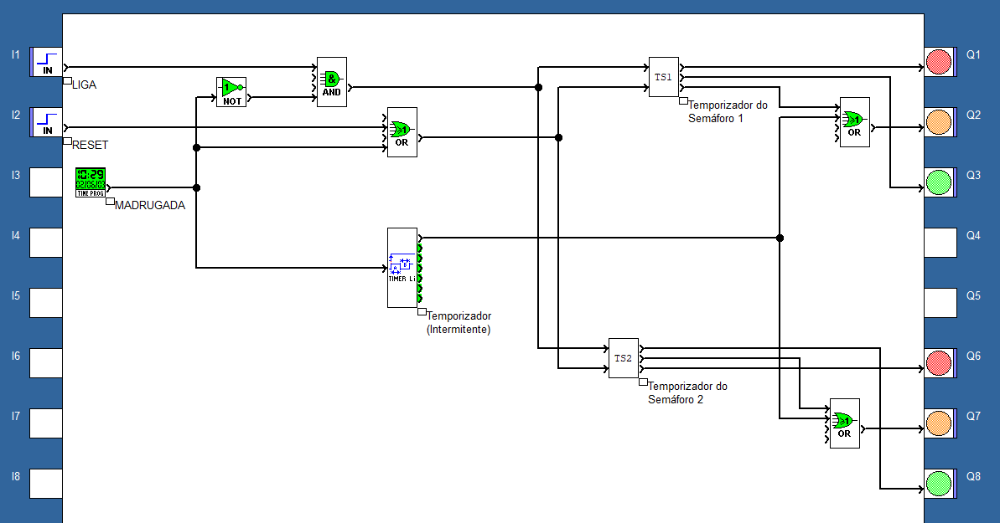

# Semáforo

## Implementação em FDB

### v1

Produto mínimo, porém ainda não viável para o contexto, que funciona com apenas 1 semáforo.

A entrada possui um filtro que captura o sinal em degrau de entrada, do usuário, e converte para impulso, garantindo que o sistema funcione corretamente.

Requisitos:

- [x] Correto funcionamento de um semáforo convencional (do vermelho para o verde e amarelo, seguindo este fluxo).
- [x] Sinal verde e vermelho por 20 segundos. 
- [x] Sinal amarelo por 3 segundos. 
- [x] Incluir botão de inicio do sistema.
- [ ] Incluir botão de reset do sistema.
- [ ] Entre 23:00 e 05:30, deixar o semáforo no estado intermitente.
- [ ] Implementar circuito com 2 semáforos funcionando juntos.
- [ ] Implementar circuito com 3 semáforos funcionando juntos.

### v2

Requisitos:

- [x] Correto funcionamento de um semáforo convencional (do vermelho para o verde e amarelo, seguindo este fluxo).
- [x] Sinal verde e vermelho por 20 segundos. 
- [x] Sinal amarelo por 3 segundos. 
- [x] Incluir botão de inicio do sistema.
- [x] Incluir botão de reset do sistema.
- [x] Entre 23:00 e 05:30, deixar o semáforo no estado intermitente.
- [ ] Implementar circuito com 2 semáforos funcionando juntos.
- [ ] Implementar circuito com 3 semáforos funcionando juntos.

#### v2 refatorada

### v3

Fluxo de funcionamento para dois semáforos:

Implementação:

O temporizadores de semáforo 1 e 2 são praticamente iguais, a diferença é ordem de funcionamento dos sinais, como foi mostrado no fluxo acima. 

Requisitos:

- [x] Correto funcionamento de um semáforo convencional (do vermelho para o verde e amarelo, seguindo este fluxo).
- [x] Sinal verde e vermelho por 20 segundos. 
- [x] Sinal amarelo por 3 segundos. 
- [x] Incluir botão de inicio do sistema.
- [x] Incluir botão de reset do sistema.
- [x] Entre 23:00 e 05:30, deixar o semáforo no estado intermitente.
- [x] Implementar circuito com 2 semáforos funcionando juntos.
- [ ] Implementar circuito com 3 semáforos funcionando juntos.