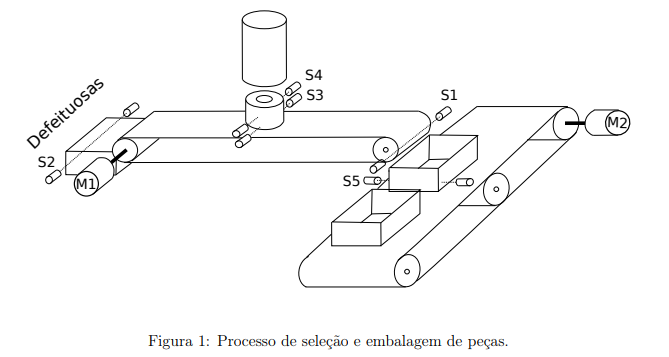

# Classificação e Embalagem

O setor de produção de uma determinada peça foi automatizado para classificar e embalar as peças boas, e descartar as defeituosas.

Todo o processo de seleção e embalagem é iniciado e parado por um botão (B1). Ao pressionar B1 a primeira vez o processo inicia, o que é sinalizado por uma lâmpada (L1). Se o processo estiver em funcionamento, pode ser parado pelo mesmo botão, o que é sinalizado
por outra lâmpada (L2).

O processo, ilustrado pela figura 1, pode ser dividido em duas partes:

1. **Classificação e seleção das peças** - Uma peça cai no meio da esteira; após 3 segundos, para estabilizar a peça, os sensores S4 e S3 verificam a altura desta. Se a peça estiver boa, ela ativará os dois sensores. Se ela ativar apenas o sensor S3 a peça deverá ser considerada defeituosa e ser descartada.

Os sensores S1 e S2, respectivamente, contabilizam as peças boas e defeituosas. A
contagem das peças boas é usada para limitar o número de peças por caixa. Esse
número máximo de peças por caixa é determinado por dois botões (B2 e B3). O
número de peças defeituosas é contabilizado para controle de qualidade da produção.
Também, se de dez peças, oito forem defeituosoas o processo deve ser interrompido
e sinalizado por uma lâmpada (L3).

2. **Embalagem das peças** - As peças boas, selecionadas pela parte descrita acima, são levadas pela esteira até a embalagem. O número máximo de peças por caixa, especificado pelos botões B2 e B3, e o sensor S1 são usados para controlar cada embalagem.

Após cheia, a esteira é deslocada pelo acionamento do seu motor (M2), para que uma nova caixa receba as peças. O posicionamento correto da nova caixa é verificado pelo sensor S5.

--- 

Programe o controlador lógico programável (CLP) para automatizar o processo descrito acima.

Considere que os motores M1 e M2 são trifásicos assíncronos de rotor curto-circuitado (indução com rotor “gaiola de esquilo”), os sensores S1, S2, S3, S4 e S5 são do tipo “feixe de luz” (quando o feixe é interrompido um contato é fechado), os botões B1, B2 e B3 são
do tipo “contato imediato”.

Ilustre a ligação das entradas e saídas do CLP aos sensores e atuadores. Representar também os diagramas de comando e potência dos motores.

## Resolução

Componentes:

- Entrada: Botões B1, B2 e B3, sensores S1, S2, S3, S4 e S5
- Processamento: Contador de peças boas C1 e de peças defeituosas C2, Timer T1 de 3 segundos.
- Saída: Motores M1 e M2, Lâmpadas L1, L2 e L3.

Equação booleana de componente de processamento (TODO):

- Contador C1
  - Contar = S1
  - Reset = (C1 >= 5)
- Contador C2
  - Contar = S2 
  - Reset = TODO

Equação booleana de cada saída (TODO):

- M1_ok = S3 * S4
- M1_defeituosa =  S3
- M2 = (C1 >= max)
- L1 = B1
- L2 = !B1
- L3 = (C2 / CTotal) >= 0.8

### Texto Estruturado (ST)

TODO

### Ladder

TODO

### FDB

TODO

### Grafcet (SFC)